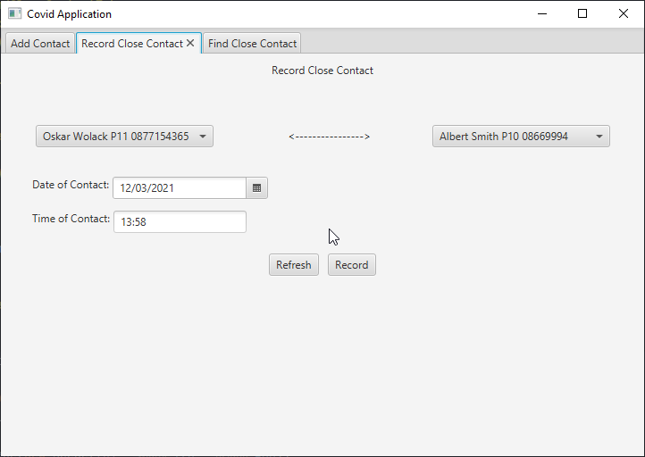
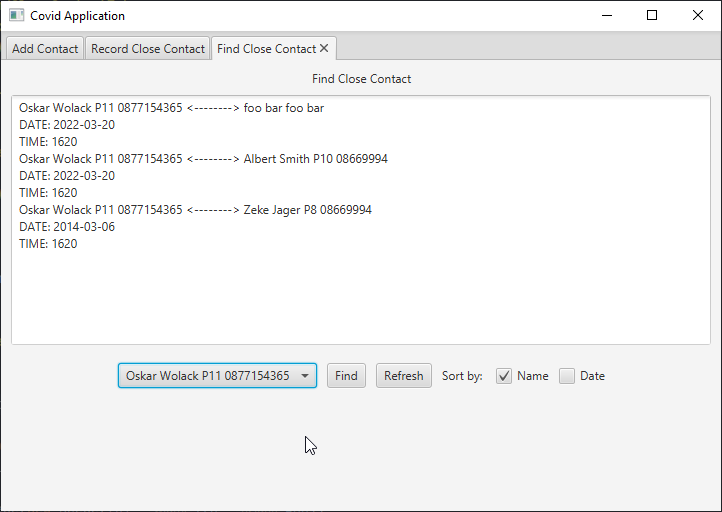
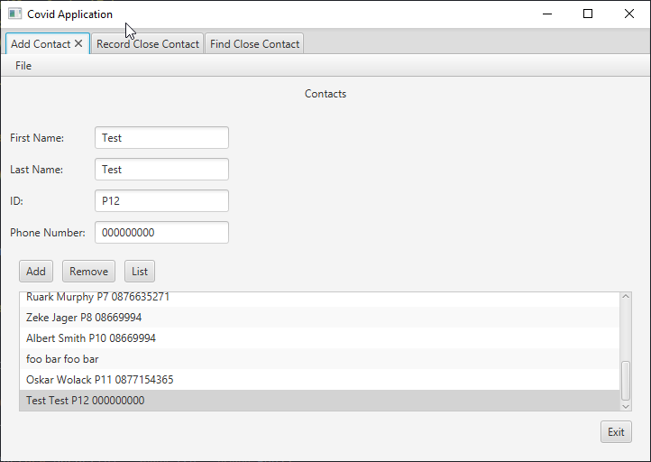
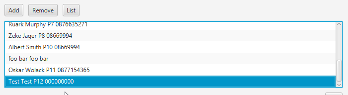

# Covid-Contact-App
An application that allows the user to add contacts, record close contacts between those contacts and find close contacts.

Code architecture follows MCV paradigm and implements the serializable interface.

Features:
 ◾ Sort find results by Name/Date

Example of recording a close contact between 2 contacts.

Finding the recorded close contact/

Recording a contact

Contact listed in ListView

